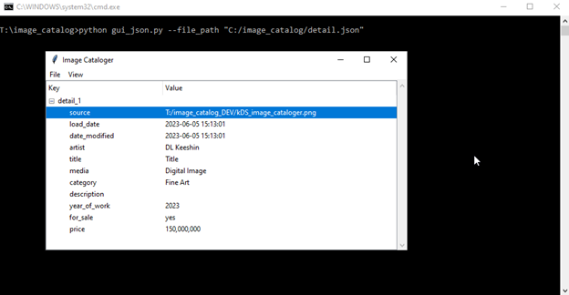
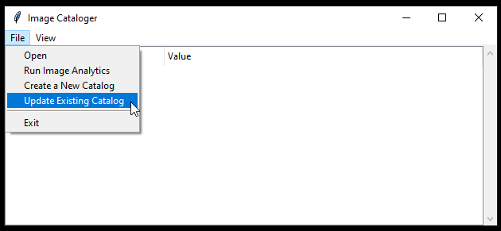

# kDS Image Cataloger

## 1. Introduction

kDS Image Cataloger is a utility designed to manage and maintain image metadata efficiently. It is designed to make the process of collecting and classifying digital photos or digital art easier. It allows you to run image analytics on your image files and generate a CSV text file with a breakdown of images by directory path, year, quantity, and size. This user documentation will guide you through the process of using the app effectively.

## 2. Installation and Setup

Before using Image Cataloger, ensure that you have:

- Python 3.8 or above installed on your system. As of November 2023, this documentation was based on Python 3.11.4. See [Python Downloads](https://www.python.org/downloads/).

  After installation, make sure the Python installation and scripts paths are set. In Windows, it looks something like:

  C:\Users\YOURACCOUNT\AppData\Local\Programs\Python\Python311
  C:\Users\YOURACCOUNT\AppData\Local\Programs\Python\Python311\Scripts

- Cloned github code to your local workstation. See   https://github.com/kds-github/image_cataloger Use github desktop or the command line.

  #### git clone https://github.com/user_account/repository.git

- Python libraries installed. Install them by running:
  
  #### pip install -r requirements.txt

## 3. Create a Device ID

Image Cataloger generates a unique ID for identifying the workstation/device you are working on. The device ID is stored along with the image file path and additional data items. From the command line in the `image_catalog` directory, run:

  ***python new_device_id.py***

## 4. Analyze Image Quantity and Size

From the command line, run:

  ***python image_analytics.py***

It generates [file_analysis.txt](file_analysis.txt) 

Use this to gauge the starting and ending years for the catalog or catalogs you need to create.

Recommendation: It is a good idea to create at least two or more catalogs. One or more for all previous years and one for the current year. As a rule of thumb, limit the number of records per catalog to no more than 5,000 to 10,000 records each.

## 5. Create a New Catalog(s)

Start the app from the command line in the `image_catalog` directory. Run:

  ***python gui_json.py --file_path "C:/image_catalog/detail.json"***

Or in Linux or a MAC:

  ***python gui_json.py --file_path "/home/users/detail.json”***
  
Note: The above command is contained in the `gui_json.bat`. You may have to change the `file_path` to reflect where you located the file on your system.

Recommendation: Once you create a catalog for the current year, you can change the batch file `file_path` to automatically open the current year(s) catalog on startup.

Select “Create a New Catalog” from the file menu, enter values for these items:

- Start Year: Starting year of the catalog.(YYYY)
- End Year: Ending year of the catalog. (YYYY)
- Catalog Path: This is the location of the `image_catalog` directory.
- Search Path: Search path for locating image files. Recommendation: Use the current user's home directory with FORWARD slashes like “C:/Users/your_account/”.
- Ignore File: This is the location of a CSV text file that contains a list of directories to ignore when the app searches for files. The default values are:

    ***C:/Users/your_account/Downloads/***\
    ***C:/Users/your_account/AppData/***

## 6. Update Image Metadata

From the command line, type or run from a batch or Linux bash script.

Click on “Source”, the image will display as well as edit window with metadata about the image.

Make changes or additions to the data as needed. Click “Save”. If you want to see your changes, click “refresh” from the “View” menu.

## 7. Picture Deck

“Picture Deck” from the view menu allows you to see up to 25 images from the catalog at once.

Double-clicking on an image will open the image. Click on “Properties,” and the property edit window will display.

## 8. Update Existing Catalog

Select "Update Existing Catalog" from the file menu.  A window will open displaying catalogs from the image_catalog directory.  Select the catalog to update.  The process will  then add any new image files not found not in the existing catalog.

